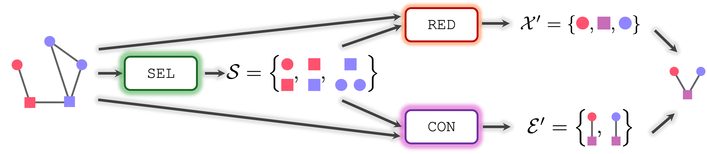
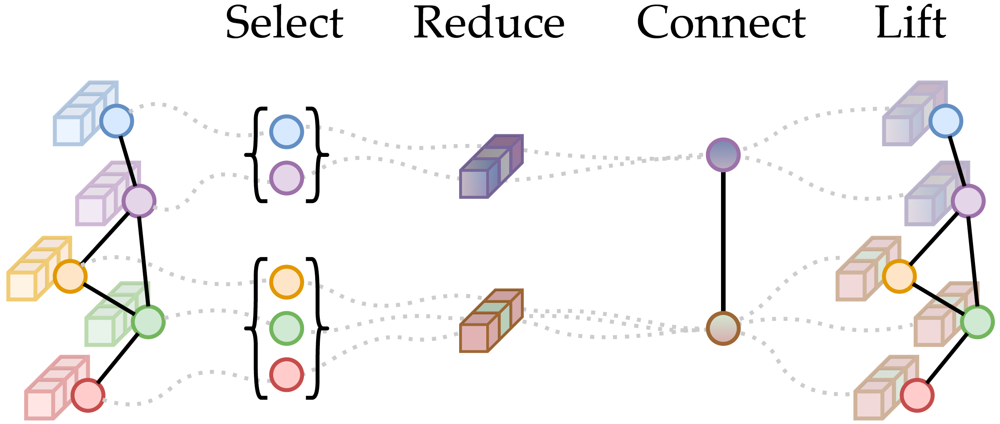
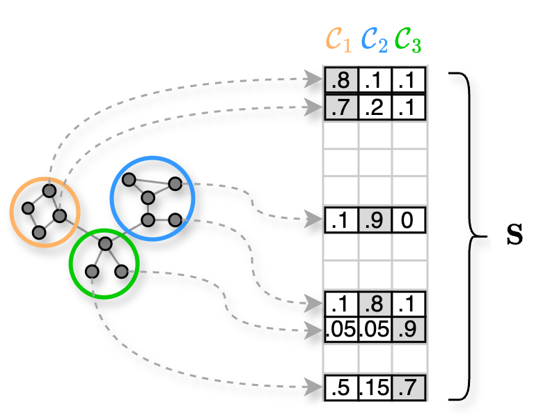
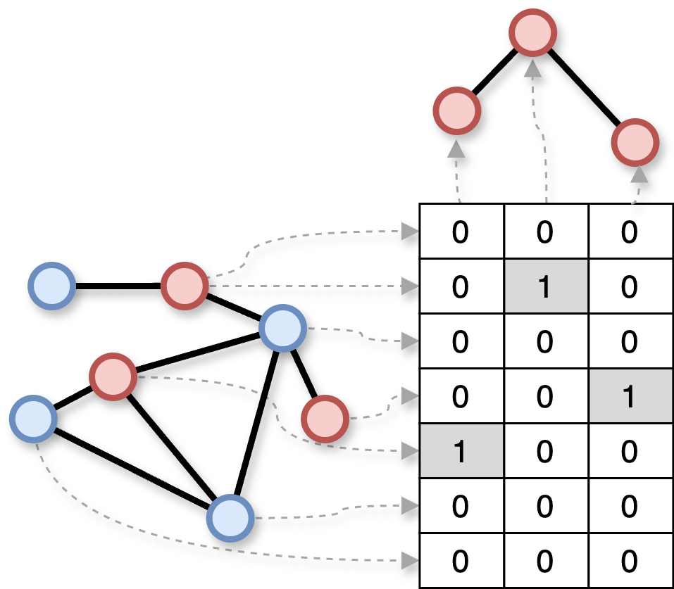
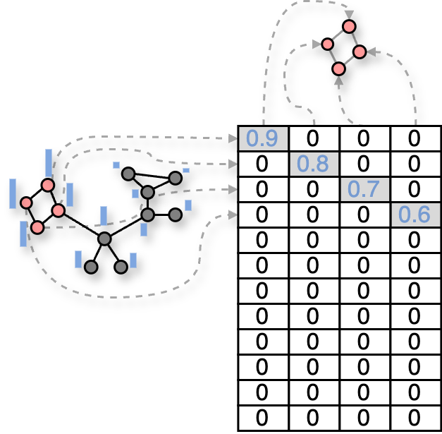

# The SRC(L) framework

Every graph pooling operator can be expressed through a framework called SRC (Select, Reduce, Connect), introduced in the paper 
[Understanding Pooling in Graph Neural Networks](https://arxiv.org/abs/2110.05292). 
The SRC framework is a powerful abstraction that allows you to define graph pooling operators in a modular way. 
In particular, a generic graph pooling operator is given by the composition of three functions: Select ($\texttt{SEL}$), Reduce ($\texttt{RED}$), and Connect ($\texttt{CON}$). Let’s say that our original graph has $N$ nodes and the node features of these nodes are stored in a set $\mathcal{X}$. Similarly, the graph has $E$ edges and the edge features are in a set $\mathcal{E}$. In the example below, the original graph has $N=5$ nodes and $E=5$ edges. Let’s also say that the pooled graph has $K$ supernodes with features  $\mathcal{X}'$, while the edge features are stored in a set  $\mathcal{E}'$. In the example, the pooled graph has 3 supernodes and 2 edges.

Even if it is not part of the original framework, there is an additional operation called $\texttt{LIFT}$, which is used to map the pooled node features $\mathcal{X}'$ back to the original node space. This is used in architectures with an AutoEncoder structure to solve tasks at the node level (e.g., node classification/regression) or at the edge level (e.g., link prediction).

Every pooling operator in  tgp is implemented according to the SRC(L) framework.

## Select
The $\texttt{SEL}$ function is responsible to decide how many supernodes the pooled graph will have and which nodes of the original graph will end up in which supernode. 
In other words, $\texttt{SEL}$ determines which nodes are selected and how they are grouped together. 
Note that $\texttt{SEL}$ can also selects only a subset of the whole nodes and discard the others. The $\texttt{SEL}$ function function is arguably the most important part of a pooling method. In fact, the specific implementation of the $\texttt{SEL}$ function is what mostly sets the different pooling methods apart.

For example, a cluster-based pooler groups the $N$ nodes into $K$ clusters, which become the supernodes of the pooled graph. 
In this case, we can think at the $\texttt{SEL}$ operation as a soft-clustering assignment matrix $\mathbf{S}$ that maps each node into its own cluster with a given value of membership.

It turns out that the output of *any* $\texttt{SEL}$ operation can be expressed with a similar matrix. 
For example, we can think at the output of a 1-over-$K$ pooling method that selects a subset of the nodes of the original graph as a matrix $\mathbf{S}$ with 1 in correspondence of the selected nodes, and 0 for nodes that are dropped.

Similary, for a scoring-based method such as Top-$K$, the select matrix will contain non-zero entries for the nodes that are kept and 0 for those that are dropped. In addition, the non-zero entries will have a value equal to the top-$K$ scores associated to the nodes that are selected.

In  tgp, the $\mathbf{S}$ matrix is contained within the object [`SelectOutput`](https://torch-geometric-pool.readthedocs.io/en/latest/api/select.html#tgp.select.SelectOutput), along with other useful information to perform pooling.

## Reduce
The $\texttt{RED}$ operations is the one responsible for computing the node features of the pooled graph. Each pooling method can implement the $\texttt{RED}$ function differently, but in general the result depends on: the topology, the node (and edge) features of the original graph, and on the output of the $\texttt{SEL}$ function. 

Let's make a practical example and let’s say that $\texttt{RED}$ computes the features $\mathbf{X}' \in \mathbb{R}^{K, \cdot}$  by taking the sum, the max, or the average of the features $\mathbf{X} \in \mathbb{R}^{N, \cdot}$ that are assigned by $\texttt{SEL}$ to the same supernode.
In matrix form, we can express this $\texttt{RED}$ operation simply as:

$$\mathbf{X}' = \mathbf{S}^\top \mathbf{X}.$$

## Connect
The $\texttt{CON}$ function is similar in spirit to $\texttt{RED}$, except that it deals with the edges and the edge features of the pooled graph. 
In particular, $\texttt{CON}$ decides how the nodes of pooled graph are going to be connected and what will end up in the edge features of the pooled graph. As for  $\texttt{RED}$, the output of $\texttt{CON}$ depends on the original graph and, clearly, also on $\mathbf{S}$, the output of the $\texttt{SEL}$.

For example, let's say that the $\texttt{CON}$ operation creates an edge $e_{ij}$ between the supernodes $i$ and $j$ by combining summing of all the edges whose endpoints are nodes assigned to $i$ and $j$, respectively.
When the aggregation operation is the sum, like in this example, we can express the $\texttt{CON}$ operation in matrix notation:

$$\mathbf{A}' = \mathbf{S}^\top \mathbf{A}\mathbf{S},$$

where $\mathbf{A}' \in \mathbb{R}^{K \times K}$ is the adjacency matrix of the pooled graph.

## Lift
The purpose of the $\texttt{LIFT}$ is to map the pooled node features $\mathbf{X}' \in \mathbb{R}^{K, \cdot}$ back to the original space. In other words, the lifted features $\mathbf{\tilde X} \in \mathbb{R}^{N, \cdot}$ and the original features $\mathbf{X} \in \mathbb{R}^{N, \cdot}$ will have the same node dimension $N$.
We can think at $\texttt{LIFT}$ as the operation that "undoes" the $\texttt{RED}$ operation:

$$\mathbf{X} \xrightarrow{\texttt{RED}} \mathbf{X}' \xrightarrow{\texttt{LIFT}} \mathbf{\tilde X}.$$

The most principled way of implementing $\texttt{LIFT}$ is by applying to the pooled node features the pseudo-inverse of the selection matrix:

$$\mathbf{\tilde X} = (\mathbf{S}^{+})^{\top} \mathbf{X}'.$$

In practice it might be enough to just use $\mathbf{S}$ to lift the features, which is faster as it avoids inverting the matrix:

$$\mathbf{\tilde X} = \mathbf{S} \mathbf{X}'.$$